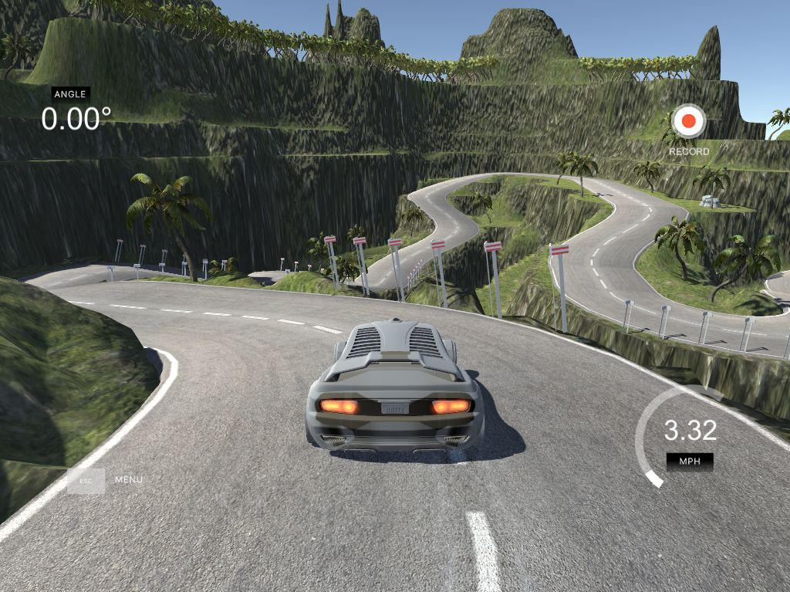

driving using behavioral cloning
---
teaching a neural net to drive using a simulator

end-to-end driving is a scam

check it out [in action!](https://www.youtube.com/watch?v=-vgAdaLyWEQ)

i'll post a higher-quality video eventually

---

writeup coming soon. in the meantime, check out [this paper from nvidia](https://images.nvidia.com/content/tegra/automotive/images/2016/solutions/pdf/end-to-end-dl-using-px.pdf) and the [project/paper from comma.ai](https://github.com/commaai/research)

---

dependencies
---
 - keras w/ tensorflow backend
 - numpy
 - scipy
 - [udacity's simulator](https://github.com/udacity/self-driving-car-sim)
